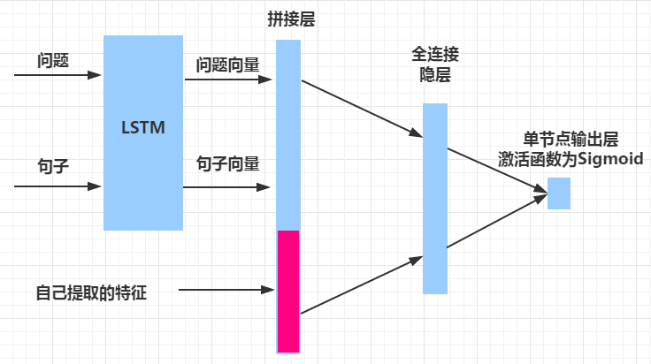

# QA-rankit

Rank candidate answers for a given question.

### Models

##### Unsupervised

We first tried some unsupervised models. Although these models are straightforward and simple, they work effectively!

- Word Overlap Count
- IDF weighted
- Q-A distance
- ...

##### Supervised
We can use those metrics calculated in unsurpervised models as features of surpervised models. Besides, we can employ other models like CNN and LSTM to extract more features.  

In this program, we tried following models:

- Random Forest
- Logistic Regression
- Mixed CNN
- Mixed LSTM

Among these models, the mixed LSTM achieved best performance.



### Source code

##### main.ipynb

Main code, edited using **Jupyter Notebook**.

You'd better open this file using **Jupyter Notebook**.

If you dont's have **Jupyter Notebook** installed on your computer, please try **main.py**. 

What main.ipynb does:
- read data
- preprocess data
- extract features
- fit models (models are implements in other source files)
- evaluate models
- predict on test dataset

#####  main.py

**.py** version of **main.ipynb**.

#####  MyLSTM.py

Implementation of an adapted LSTM model using Keras.

#####  MyCNN.py

Implementation of an adapted CNN model using Keras.

#####  MyGA.py, ParamGA.py

Implementaion of an adapted Genetic Algorithm using DEAP.

This can be used to find respectable parameters for sklearn models, like RandomForestClassifier.

#####  PairWiseRanker.py

Implementation of pairwise ranking algorithm.

#####  util.py, word2vec_util.py

Implementation of some tools. 

### Running environment settings

This program is developed under **Python 2.7**.

Packages that this program uses include:
- Pandas
- Numpy
- DEAP
- NLTK
- Keras

This program also uses **learning2rank**. This original repository of learning2rank is https://github.com/shiba24/learning2rank. I forked it and made some modifications. The repository is https://github.com/betterenvi/learning2rank. Therefore the modified version will be better if you want to use learning2rank.

learning2rank also uses some packages, please install them if you want to use learning2rank.

It's possible that I miss some packages that this program actually uses. Therefore, I used the following command to generate **requirements.txt** file:

```bash
$ pip freeze > requirements.txt
```

then you can run the following command:

```bash
$ pip install -r requirements.txt
```

Actually, many packages listed in **requirements.txt** have been included in Anaconda. 
